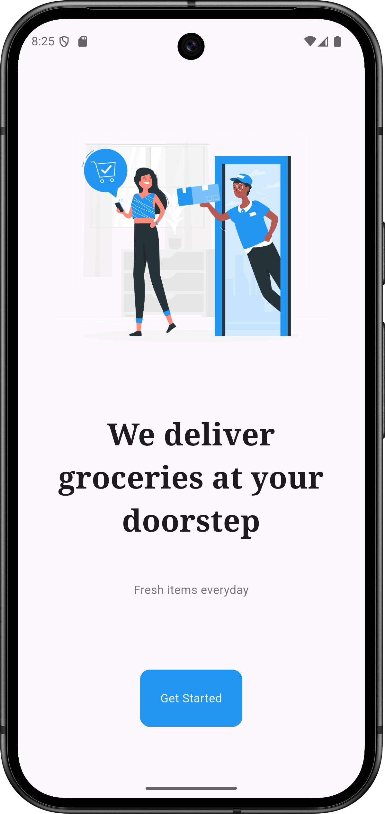
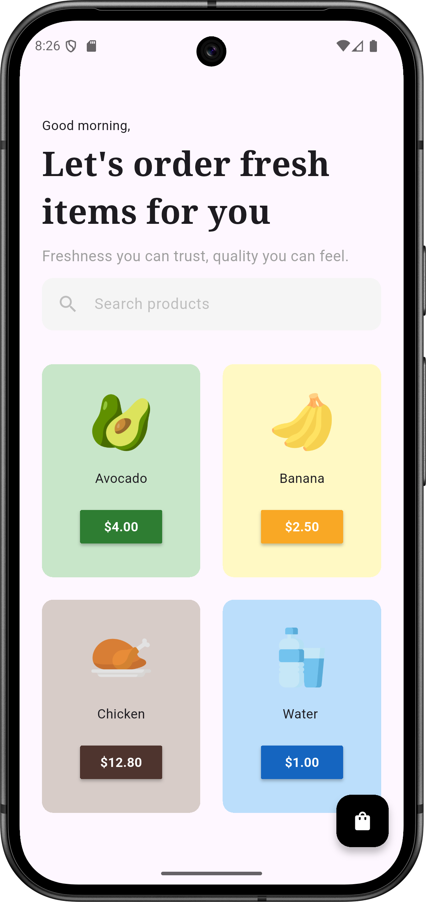
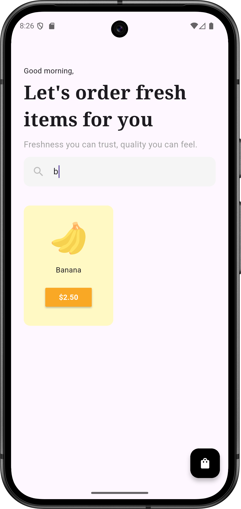
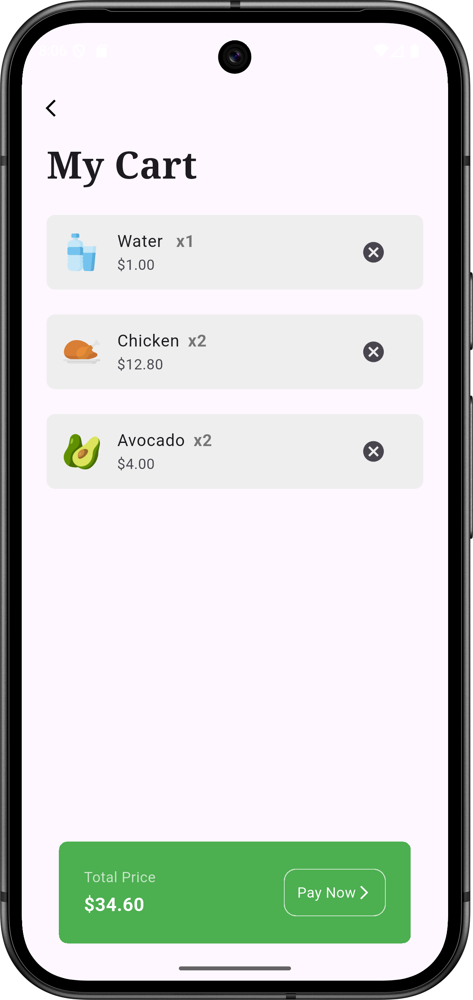
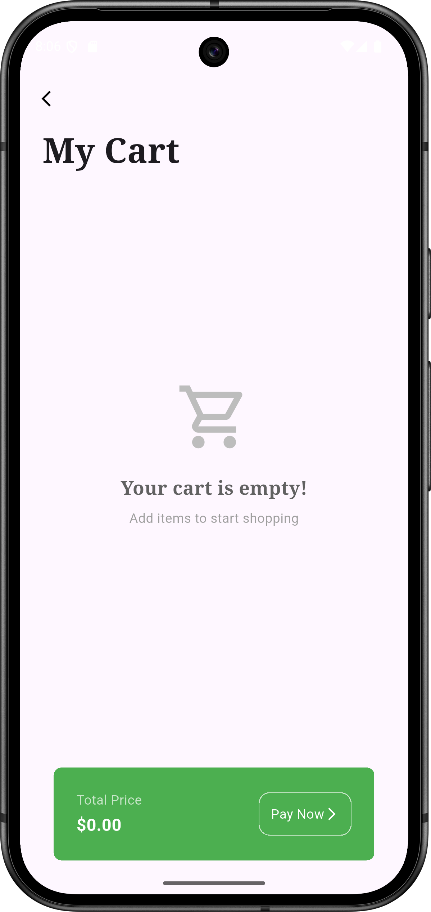

# 🛒 Grocery Shop App

A modern, fast, and user-friendly grocery shopping application built with Flutter. This project focuses on a clean UI/UX, efficient state management, and seamless search functionality.

## 📸 Screenshots

  
  
  
  
  

## ✨ Key Features

* **Smart Search Engine:** Filter fresh items in real-time as you type to find products instantly.
* **Consolidated Cart Logic:** Instead of duplicate rows for the same item, the app intelligently increases the quantity (e.g., x2, x3).
* **Dynamic Pricing:** Automatically calculates total costs based on item prices and their respective quantities.
* **Modern UI/UX:** Features professional Storyset illustrations, Apple-style iconography, and a clean "Soft UI" search bar.
* **Empty State Handling:** A beautiful custom screen for when the cart is empty to guide users back to shopping.

## 🛠 Technical Stack

This project was developed following a professional mobile application development curriculum. It utilizes a modern architecture to handle data modeling and UI rendering.
**Framework:** **Flutter SDK** for high-performance, cross-platform UI development.
**Language:** **Dart SDK**, leveraging modern syntax, a collection (List), and **Null Safety**.
* **State Management:** **Provider** was integrated for reactive state updates and synchronized cart logic (Advanced implementation beyond core basics).
* **UI Architecture:**
    * **Widget Tree:** Strategic use of **Stateless** and **Stateful** widgets to manage the application lifecycle.
    * **Layouts:** Complex layouts utilizing `GridView` for product catalogs and `ListView.builder` for dynamic cart items.
    * **Components:** Custom implementation of `Container`, `Row`, `Column`, `Padding`, and `Expanded` for a responsive design.
* **Data Modeling:**
    * **Model-Driven Development:** Custom model classes for structured data handling.
    * **Advanced Logic:** Name-based matching algorithms to ensure data integrity during real-time search filtering.
* **Navigation:** Managed via **Navigator** and **MaterialPageRoute** to handle seamless page transitions and data passing.
* **Assets & Styling:**
    * **Asset Management:** Local asset integration for images and icons.
    * **Typography:** Professional editorial look using **Google Fonts (Noto Serif)**.
* **Build Environment:**
    * **IDE:** Developed using **Visual Studio Code**.
    * **Compatibility:** Optimized for **Java 21** and **Android Gradle Plugin (AGP) 8.2.2** to meet 2026 build standards.

### 👨‍💻 Development Notes
This project was developed as an evolution of standard tutorials, upgraded to meet 2026 standards. Significant efforts were made to resolve complex **Gradle build exceptions** and **JDK 21 compatibility issues** encountered during the setup phase.

---